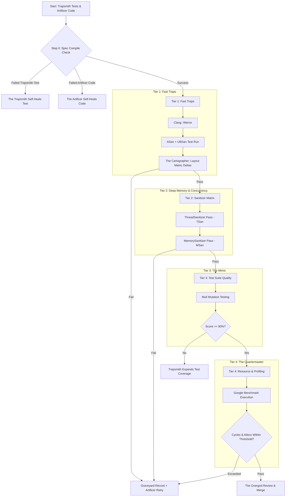

# Project KEEPER: Keeping End-to-End Paranoia in Engine Reliability
*(Alternative domain variant: Keeping End-to-End Paranoia in Engine **Rendering**)*

> **KEEPER** is an autonomous, zero-trust C++ development pipeline built on the **Dungeon Keeper / Gauntlet** architecture. It shifts the human developer to an architectural arbitrator ("The Overgod") while AI agents and deterministic CI components autonomously write, attack, profile, and verify the codebase.

---

---

## 1. Executive Summary

This architecture implements an autonomous, adversarial, zero-trust C++ rendering engine pipeline using the **"Dungeon Keeper / Gauntlet"** paradigm. 

The core philosophy shifts human engineers from writing and debugging low-level C++ to acting as **Architectural Arbitrators ("The Overgod")**. Autonomous AI agents and deterministic CI systems assume full responsibility for writing specifications, implementing logic, attacking boundary conditions, auditing test quality, and enforcing resource and memory limits.

```
       [RFC / Spec]
            │
            ▼
    [The Overgod (Human)]
            │
            ▼
   [The Architect (AI)] ──────► .hpp Contracts + C++20 Concepts
            │
      ┌─────┴────────────────────────────────┐
      ▼                                      ▼
[The Artificer (AI)]                [The Trapsmith (AI)]
   writes .cpp                         writes GTest suites
      │                                      │
      └───────────────┬──────────────────────┘
                      ▼
            ┌───────────────────┐
            │   THE GAUNTLET    │
            ├───────────────────┤
            │ Tier 1: Fast Traps│ (Compile, ASan/UBSan, Geometric Deltas)
            ├───────────────────┤
            │ Tier 2: Heavy     │ (Sanitizer Matrix: TSan/MSan)
            ├───────────────────┤
            │ Tier 3: Quality   │ (The Mimic: Mull Mutation >= 90%)
            ├───────────────────┤
            │ Tier 4: Profiler  │ (The Quartermaster: Google Benchmark)
            └─────────┬─────────┘
                      │
        ┌─────────────┴─────────────┐
     [Pass]                      [Fail]
        │                           │
        ▼                           ▼
[The Overgod Merge]         [Graveyard RAG + Feedback Loop]
                                    │
                                (Retry <= 5)
                                    │
                        [Deadlock Summarizer ──► Human Escalation]
```

---

## 2. Core Entities & Roles

| Role | Entity Type | Responsibilities & Mechanics |
| :--- | :--- | :--- |
| **The Overgod** | Human (You) | System architect and final arbitrator. Writes high-level RFCs, resolves deadlocks when retries exhaust, and provides final sign-off on architectural elegance. |
| **The Dungeon Master** | CI/CD Orchestrator | State manager (GitHub Actions / Antigravity Python graph). Dispatches jobs, routes artifacts/compiler logs, enforces safety policies, and handles step-failure transitions. |
| **The Architect** | AI Agent | Translates RFCs into strict, compile-time verifiable C++20 contracts (`.hpp`). Mandates `std::span`, smart pointers, RAII, and C++20 Concepts before any logic is written. |
| **The Artificer** | AI Agent | Writes the C++ implementation (`.cpp`). Operates in an autonomous self-healing loop with negative prompt conditioning via **The Graveyard**. |
| **The Trapsmith** | AI Agent | Adversarial Red Team. Generates deterministic unit tests targeting malformed UTF-8, ZWJ sequences, Bidi boundaries, and empty buffers. Tests must compile against `.hpp` before entering the Gauntlet. |
| **The Acid Pit** | CI Tool (Sanitizers) | Matrix-based runtime autopsy. Executes tests under mutually exclusive sanitizer passes (Pass A: ASan+UBSan, Pass B: TSan, Pass C: MSan) to eliminate false assumptions. |
| **The Mimic** | CI Tool (Mutation) | Test suite auditor. Injects mutations into `.cpp` using Mull. Fails if The Trapsmith's tests fail to kill mutants (Mutation Score < 90%). Gated to run only on Tier 1 passing code. |
| **The Cartographer** | CI Script | Deterministic layout verification. Evaluates HarfBuzz-level buffer metrics (glyph IDs, cluster indices, float advances, bounding boxes) against baseline deltas—strictly avoiding rasterization variance. |
| **The Quartermaster** | CI Tool (Profiler) | Resource cost auditor. Executes Google Benchmark binaries to monitor CPU cycle counts, cache misses, and heap allocation counts. Prevents defensive deep-copy cheats. |
| **The Beholder** | CI Infrastructure | 24/7 continuous fuzzing. Uses `libFuzzer` / OSS-Fuzz targets on the main branch to continuously bombard layout parsers with mutated byte streams. |
| **The Oracle** | AI Agent | Long-term trend forecaster. Scheduled cron agent analyzing historical performance drift, compiler toolchain upgrades, and dependency vulnerability shifts. |
| **The Scavenger** | AI Agent | External code scout. Searches trusted open-source engines (e.g., HarfBuzz, Chromium) for canonical algorithms, strictly enforcing **SPDX license compatibility** (no GPL poisoning). |
| **The Graveyard** | Vector RAG DB | Anti-Pattern Memory. Stores failed code revisions, sanitizer tracebacks, and deadlock logs. Produces negative constraints to halt circular agent reasoning. |

---

## 3. Tiered Gauntlet Execution Model

To prevent mutation testing and sanitizers from exploding iteration latency, tests run in **staged verification tiers**:



### Sanitizer Matrix Rules
Clang runtimes prohibit linking conflicting sanitizers simultaneously:
* **Pass A (Fast Gate)**: `-fsanitize=address,undefined -fno-omit-frame-pointer`
* **Pass B (Concurrency Gate)**: `-fsanitize=thread` (isolated from ASan)
* **Pass C (Memory State Gate)**: `-fsanitize=memory -fsanitize-memory-track-origins` (requires instrumented standard library build)

---

## 4. Contract Engineering (The Architect's Protocol)

To reduce agent debugging iterations, constraints are enforced via **C++20 Type System Invariants** rather than runtime checks alone:

1. **Explicit Ownership**: Zero raw pointer declarations. Buffers must use `std::span<const std::byte>`, `std::unique_ptr`, or custom pool handles.
2. **C++20 Concepts**: Header contracts must declare validation concepts for all template and engine inputs:
   ```cpp
   template <typename T>
   concept TextShapingBuffer = requires(T b, size_t idx) {
       { b.glyph_id(idx) } -> std::same_as<uint32_t>;
       { b.advance_x(idx) } -> std::same_as<float>;
       { b.cluster(idx) } -> std::same_as<uint32_t>;
       { b.size() } -> std::same_as<size_t>;
   };
   ```
3. **Immutability & Safety**: 
   * Compulsory `[[nodiscard]]` on all parse/render result objects.
   * `consteval` and `constexpr` for lookups, tables, and state transitions where viable.
   * Total prohibition of `#pragma` warning suppressions or unchecked casts (`reinterpret_cast`).

---

## 5. Directory Structure & Permission Boundaries

```
.
├── .antigravity/
│   ├── gauntlet_graph.py           # Master execution graph and agent orchestration
│   ├── safety_policies.json        # Immutable agent permission boundaries
│   ├── memory/
│   │   ├── graveyard_db/           # Local ChromaDB/SQLite anti-pattern embeddings
│   │   └── graveyard_query.py      # Negative prompt extraction script
│   └── prompts/
│       ├── architect_system.md     # Header contract and C++20 concept rules
│       ├── artificer_system.md     # Code generation rules + negative constraints
│       ├── trapsmith_system.md     # Red-team adversarial test creation rules
│       ├── scavenger_system.md     # OSS search, extraction, and SPDX compliance
│       └── deadlock_analyst.md     # Root-cause diagnostic generator
├── traps/                          # CI Deterministic Verification (Read-only to Agents)
│   ├── sanitize_matrix.sh          # ASan/TSan/MSan runner
│   ├── mutation_gate.py            # Mull test runner (threshold: 90%)
│   ├── cartographer_delta.py       # Glyph layout metric comparator
│   └── performance_auditor.py      # Google Benchmark metric comparator
├── docs/
│   └── rfcs/                       # RFC documents written by The Overgod
│       └── RFC_001_Feature.md
├── src/                            # The C++ Engine Root (Write access by Artificer)
│   ├── CMakeLists.txt              # Hardened build config (Read-only to Agents)
│   ├── engine/                     # Target for .hpp and .cpp production code
│   └── fuzz/                       # The Beholder target directory
│       └── fuzzer_target.cpp
└── tests/
    ├── baseline/                   # Golden metrics for The Cartographer
    └── autogenerated/              # Target directory for The Trapsmith's tests
```

### Safety & Permission Matrix
* **No AI Agent** possesses write access to:
  * `.antigravity/**`
  * `traps/**`
  * `src/CMakeLists.txt`
  * `tests/baseline/**`
* **The Artificer** can only write to: `src/engine/*.cpp`.
* **The Architect** can only write to: `src/engine/*.hpp`.
* **The Trapsmith** can only write to: `tests/autogenerated/*.cpp`.

---

## 6. Deadlock Arbitration & Conflict Diagnostic

When The Artificer exhausts its retry budget (5 iterations) without satisfying all traps, the pipeline halts and generates an automated **Deadlock Summary** for The Overgod:

```markdown
### DEADLOCK ALERT: Iteration Limit Exceeded (5/5)
- **Target Feature**: RFC_001 (Zero-Width Joiner Complex Shaping)
- **Primary Conflict**: Memory Budget vs. Runtime Safety
- **Trapping Entity**: The Acid Pit (AddressSanitizer) & The Quartermaster
- **Root-Cause Analysis**:
  * In iteration 3, Artificer eliminated ASan Heap-Use-After-Free by allocating a 
    deep-copied vector for glyph cluster sequences.
  * In iteration 4, Quartermaster rejected the patch: heap allocations exceeded 
    baseline threshold by 420% (+12,000 allocs / 10k glyphs).
  * In iteration 5, Artificer switched to a static buffer; Trapsmith broke it with a 
    64KB ZWJ sequence causing buffer overflow.
- **Recommended Overgod Action**:
  * Update The Architect's contract to accept a caller-owned monotonic arena allocator 
    (`std::pmr::monotonic_buffer_resource`).
```

---

## 7. Implementation Roadmap

1. **Phase 1: Environment & Tooling Setup**
   * Configure Clang 18+, Mull mutation testing framework, Google Benchmark, and Google Test.
   * Assemble `sanitize_matrix.sh` for multi-pass verification.
2. **Phase 2: RAG Graveyard Deployment**
   * Build `graveyard_query.py` using a local vector store storing failure diffs and error stack traces.
3. **Phase 3: Prompt Engineering & Permission Locking**
   * Write and freeze system prompts for Architect, Artificer, Trapsmith, and Scavenger.
   * Lock write permissions via `safety_policies.json`.
4. **Phase 4: Pipeline Automation**
   * Assemble `gauntlet_graph.py` orchestrator linking agent outputs directly to compiler and test diagnostics.
5. **Phase 5: Baseline Benchmark & Golden Layout Setup**
   * Establish initial HarfBuzz-level reference metrics for text layout verification via The Cartographer.
